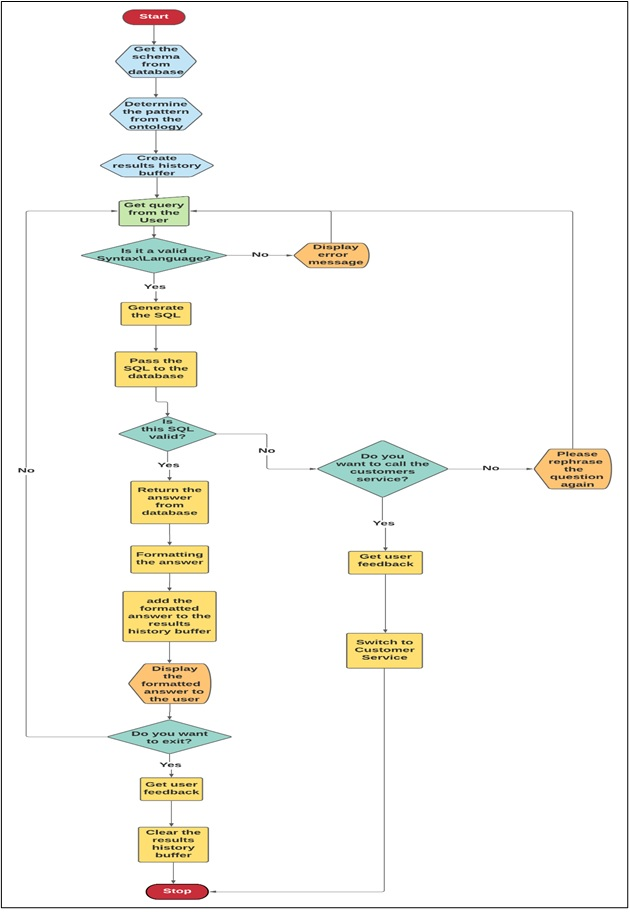
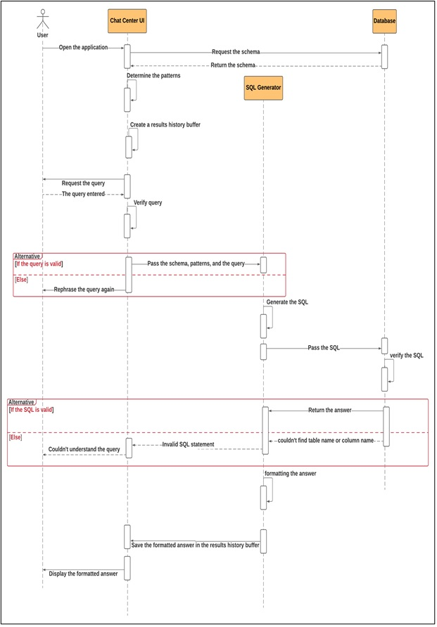
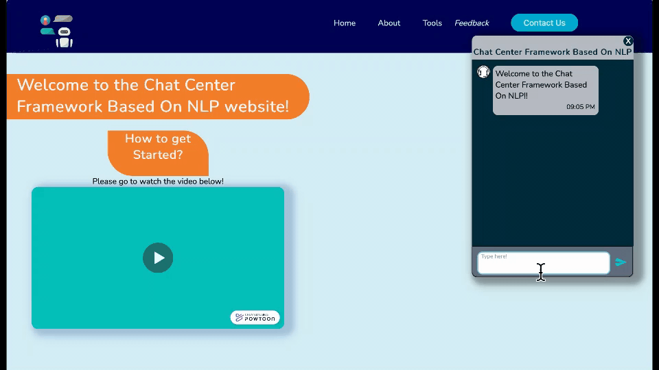

# text-to-sql-GPT2  
    

# Project Motivation  
The project aim to simplify the interactions with SQL databases by removing the need of writing SQL queries, instead users will ask a natural language (English) question.  

features:  
1- works with any SQL database.  
2- use natural language (English) instead of SQL to interact with the database.  
3- returned answer is formatted to look like a human responce.  

# File Descriptions  
Text_To_SQL_report.pdf: Final report ducomnting the process of bulding the project.  
Text_To_SQL_preasntation.pptx: Preasintation summarizing the project.  

# Diagrams:  

Flow Chart:  
  
  
Sequence Diagram:  

# Program in action  

 

# Acknowledgment  
Datasets:  
[SParC](https://yale-lily.github.io/sparc)  
[Spider](https://yale-lily.github.io/spider)  
[CoSQL](https://yale-lily.github.io/cosql)  
  
Special Thanks:  
Special thanks to Dr.Muhammed Dahab for his supervision and guidance through the whole project, also a Special thanks to my team members for their hard work and cooperation.  

Team:  
[Hazim](https://github.com/FancyWhale69/)  
[Sultan](https://github.com/sultan-1/)  
[Ahmed](https://github.com/AhmedF305/)
