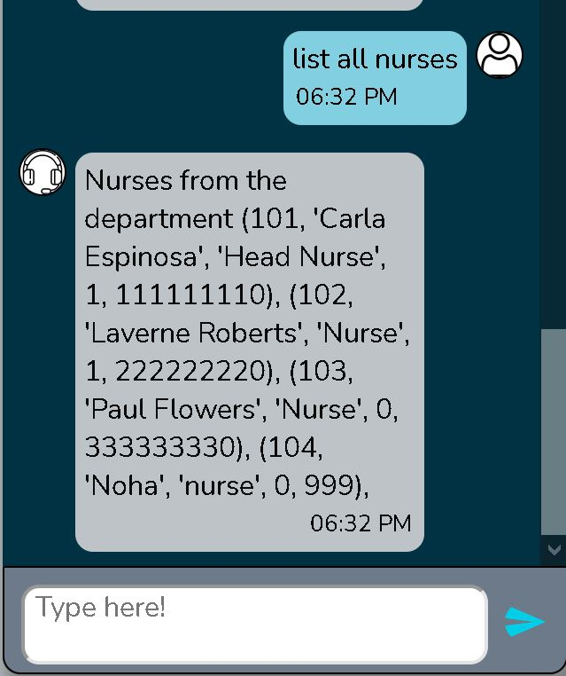
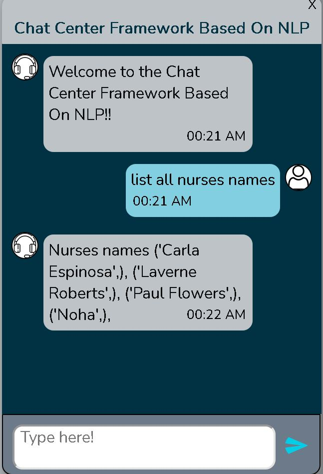

# text-to-sql-GPT2  

# About:  
My graduation project from King Abulaziz University Computer Science Department. The project goal is to build a system to retrive data from any database
it connects to.  
Note: project will be available after my graduation.

# Tools:  
python, flask, openAI GPT2.  

# Why GPT2:  
GPT2 is a very powerfull text generator developed by openAI, and was trained on text from the web. In theory if given enough data it can be used to generate valid SQL querries for any database.  
  
# ScreenShots:  
Note: system is connected to a hospital database (hospital_1.sqlite from sparc dataset).  

  
  
    

